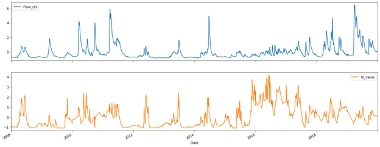

# Multivariate Time Series Analysis on water data
Water Pollution is a significant threat in most rivers near big cities nowadays. We use data about pollutants in the watershed of the Mississippi River. For our task, we focused on the data for the following contaminants: 

●	Total suspended solids

●	Total phosphorus

●	Nitrate plus nitrite nitrogen

●	Total Kjeldahl nitrogen

●	Dissolved orthophosphate
For each of these pollutants, we do a multivariate time series analysis with the flow value of the river. Daily data of 2008-2019 available with very few missing values. 

## Data Prepocessing
Before running our forecasting models on the dataset, some essential preprocessing steps will affect our choice of models later on, so it is vital to go through these steps.

### Missing Values
Several real-world datasets can have missing values for a variety of reasons. NaNs, blanks, and other placeholder used to represent them. Using a dataset for our case, many missing values to train a machine learning model can significantly impact the model's output. Some algorithms, like scikit-learn estimators, assume that all values are numerical and have meaning. One approach to this problem is to remove the observations with missing data. However, there is a danger that a data point containing helpful information will be lost. Imputing the missing values, i.e. infer those missing values from the available data, would be an ideal way.

For our case, we saw through results that quadratic interpolation and kNN imputation both produced slightly better results than the other methods for the set of algorithms we had selected. For simplicity and negligible difference in outcomes, we used quadratic interpolation.

### Feature Scaling
The magnitude, range, and units of the features are all different. This is a big challenge because a few machine learning algorithms are sensitive to these characteristics. Feature scaling is a technique for normalising a set of independent variables or data components. The process of rescaling values to [0,1] is known as normalisation. By scaling a feature X with its minimum and maximum values, the following formula transforms it.

X' = (X - min(X))/(max(X) - min(X)) 

### Elements of time series

 

 
The above figure shows the scaled values of the Flow and Total Suspended solids with respect to the temporal axis. On thorough inspection of this representation, we can make the following conclusions:

●	Trend: Both the time series don't exhibit a continuous increasing or decreasing trend. Hence we conclude that the time series doesn't show any trend.

●	Seasonality: Although our data does show fluctuations in values at intervals of time, the intervals are not regular enough to call the series seasonal. Hence we conclude that the time series has no seasonal component.

●	Cyclic: We can see that the data exhibits a cyclical pattern. The values of both Flow and Total Suspended solids keeps fluctuating. Hence we can conclude that the data shows a cyclical pattern.

●	Irregular: This component takes into account the randomness in the values. Our model aims to explain all the parts except the irregularity factor since we can not explain it. Our data shows a lot of irregularities with peak values and random level shifts. We can conclude that our data is highly irregular.

